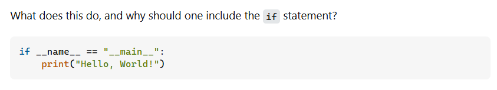
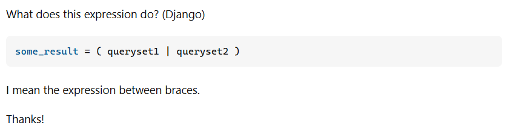

## Smart questions, what are they?

When it comes to working as a software engineer, or even just as a member of a workplace where people interact with each other regularly, asking questions is very important to facilitate effective communication. So important, in fact, that I would argue that productive two-way communication is literally impossible without asking questions, and such communication is the backbone of every single kind of collaborative work (such as software engineering projects). It does not have to be verbal communication either, it could even take the form of written or digital communication. Taking this a step further, a smart question esssentially is one that is very clear, specific, easy to understand, and easy to answer (to whoever has the knowledge to answer it). 

## Examples

For some an example of a smart (and a not-so-smart) question, we can look towards StackOverflow, a very popular website where software developers post any questions they might have. 

Finding an example of a smart question was pretty easy. All I had to do was look through some of the highest rated ones. Here is a great <a href="https://stackoverflow.com/questions/419163/what-does-if-name-main-do">example</a> of a smart question.

Finding an example of a not smart question was quite a bit harder. For starters, StackOverflow's website usually displayes the highest rated questions first, and those questions are pretty much universally "smart" ones. There is also no specific tags or sets of words that I could use to look for a not smart question. I eventually did find this <a href="https://stackoverflow.com/questions/36020630/what-does-this-expression-do-django">example</a> after some digging. I chose this one specifically due to its similarities to the smart questione example above.

## Why one is smart while the other is not

The smart question example immediately opens up with a very specific title that clearly states what the question is asking about. The question itself is also very short and succinct, and asks for something that is both specific and can be easily answered. At first glance however, this question does seem like something that could easily be figured out with a single google search, thus rendering it pretty useless and not that smart of a question. That is until you realize that it was asked about 16 years ago, before there was that much online resources on coding. Indeed, being a smart question, it has obtained a score of over 8000, with a similarly highly-rated. The response itself is also much more detailed than one could expect from such a seemingly simple question.

The second not-so-smart question example, although it shares similarities with the smart example, it has some subtle pitfalls that makes it not quite smart. First of all, the title to the question is very vague. The actual question itself does little to make it more specific, essentially restating the already vague title. Even the asker realized that they had to provide some kind of clarification by stating "I mean the expression between braces". This question is also one whose answer could easily be searched up and found within documentation, rendering it kind of redundant and unnecesary. Indeed, the only response this question received provided a link to the documentation itself.

## Conclusion

Questions are an invaluable part of communication, and it is necessary to ask questions in the workforce in order to enable efficient and collaborative work. Smart questions can be very productive, potentially even opening up entire discussions surrounding the topic. Not so smart questions however cause confusion, and can potentially waste the time of peers and coworkers. In this new age of AI, however, asking smart questions may not be as necessary as before, as an AI like ChatGPT or DeepSeek would be perfectly capable of instantly providing an answer to nearly every question within its capabilities.
