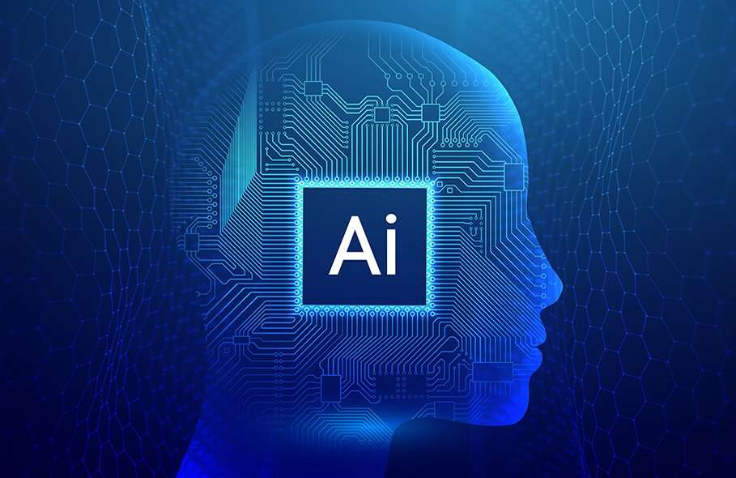

# ...And How I Used It In My Class (And Beyond)

## I. Introduction

The emergence of seemingly all-knowing artificial intelligence in recent years has had large scale impacts on modern education. Because of its ability to quickly and seemingly be able to answer any question or conjure up any thought, artificial intelligence has been used both officially in the classroom to help explain material and even formulate lesson plans, and unofficially by many students for everything from helping to make study material to further explaining reading topics the student may not understand. 

One of the main driving forces behind AI’s seemingly limitless ability is its ability to perform deep learning and analysis: essentially using simulated “neurons” allowing it to approximate anything to near (or in many cases literal) perfection, and perform advanced arithmetic analysis on the more analytical topics. Many modern AI platforms use this, including but not limited to: ChatGPT, Co-Pilot, and Claude. In the class for Software Engineering 1 at my university: ICS 314, I have made use of Github Co-Pilot on many occasions.

## II. Personal Experience with AI:

For my ICS 314 class specifically (a list of various topics and how I used/did not use AI on it):

### 1. Experience WODs e.g. E18

I did not use AI for the initial experience WODs (EWODs), as they were mostly ones that tested your algorithmic knowledge at first, using simple code that I was familiar with, but I did use Co-Pilot for the more web-dev oriented EWODs, such as Digits (E49 - E54). 

The main reason why was that I was extremely unfamiliar with the workings of various web-dev tools such as React and Nextjs, and AI allowed me to quickly understand the code and formatting required to make web pages using said tools, as well as debugging any confusing errors. This will be a very commonly recurring reason why I used AI going forward in this essay.

### 2. In-class Practice WODs

I did not use AI initially, when the WODs more or less was just algorithmic knowledge, but as the  practice WODs moved into web-dev territory I am a little embarrassed to say that I became more and more reliant on the AI to help me. Specifically when doing things such as generating and/or explaining the functionality of React components.

### 3. In-class WODs

Same as above, with AI helping me tremendously underneath the time constraints when developing web pages.

### 4. Essays

This is the main topic in this class that I never used AI with. Every essay that I made was purely made from my mind and hands. I may talk about AI in my essays, but I never used any AI tool to write or even help me to write an essay. I felt like I should not use AI for this topic specifically, as it would take away from my own personal voice and the nuance in my writing. AI systems like ChatGPT have pretty recognizable styles of writing, in my opinion. Plus, I feel that I should not use AI for at least the one skill that I am learning in this class that I could apply to everywhere and anywhere else: writing.

### 5. Final project

In a completely opposite direction to the last topic, I used AI heavily in this one. Similar to what I said about the WODs, I used Co-Pilot to help generate and fix the bugs in web components.

### 6. Learning a concept / tutorial

This one is a bit vague. If learning tutorials/concepts from the EWODs, then yes I did use AI to help me with web-dev. But learning about React/TypeScript/HTML I did that on my own. I felt that if I am gonna be using AI a lot, I should at least have a good grasp at the very fundamentals so that I at least know why things are working the way they are.

### 7. Answering a question in class or in Discord

Never used AI for this. Although I answered maybe only one question on Discord as far as I remember (it was about one of the EWODs), it was using purely what I knew and understood.

### 8. Asking or answering a smart-question

Similar to above, never used AI for this. Used purely what I knew. I admittedly did not do this very much at all either.

### 9. Coding example e.g. “give an example of using Underscore .pluck”

I used AI extensively here to help me with web-dev related questions. For example: using AI to give me an example of a value registry system to submit data on a page.

### 10. Explaining code

Similar to above, I used AI to explain React components whenever I needed help.

### 11. Writing code

Yes, I used AI when writing code on various EWODs, in-class WODs, practice WODs, and for projects. Although I would always manually retouch the code afterwards to address any errors and to fit the code to any kind of required coding style.

### 12. Documenting code

Never used AI for this, as I had not yet felt the need to. I wrote all the documentation for my code by hand using my own understanding. For example: documenting how developers can use our code for our final project.

### 13. Quality assurance e.g. “What’s wrong with this code <code here>” or “Fix the ESLint errors in <code here>”

This is quite literally the number one reason why I used AI in this class. Many a time I would write some web component, and it would not behave at all like I thought it would, throwing dozens of esoteric errors at times. AI was such a tremendous help here.

### 14. Other uses in ICS 314 not listed

As far as I remember I do not think I used AI for anything other than the topic listed above.

## III. Impact on Learning and Understanding

As one could probably ascertain from my answers above, AI use tremendously sped up my ability to learn and understand material, mainly through the form of helping to explain problems that I could not even begin to grasp. Especially within software engineering and web-dev, where I felt there was a lot of black-box functionality that I had to follow.

I am sure this is the case for students everywhere, and it is likely the biggest reason why AI use is so popular in education: AI acts as a tutor that never sleeps, and one that seemingly knows everything. This could also potentially dampen a student’s problem solving ability, as they may become reliant on this AI tutor to do everything for them. 

## IV. Practical Applications:

In the workforce, AI can be used to increase the productivity of each individual engineer and the efficiency of a software engineering team through making writing code and documentation way faster. There are also many software engineering projects out there that are made solely to express the functionality of AI, with numerous such startups formed around AI/LLM focused tools. Some are worth billions of dollars, such as Scale AI. 

Although AI helps tremendously in coding, commercial software engineering in the real world is far more complex than just writing React components and coding as a whole is but a small section of developing apps such as Google or Instagram. The main part of software engineering from what I heard of is the design behind the system, and that is something that AI cannot do quite well yet, and is where humans are still required.

## V. Challenges and Opportunities

While AI is quite a powerful tool, it of course has its limitations. From my use of AI, there were some errors that it was not able to fix on its own, which I and/or my team members had to fix manually. For example on our final project, our page for reporting user inputted data was just seemingly not reporting any data. AI was not really that big of a help here, as every suggestion it made did not even seem to diagnose the issue. 

It was not until, with the help of my team members, that we found out that it was due to a small line of code in a completely different file, about 6 characters long that threw no errors, that prevented the whole functionality of adding user data due to it not validating (the string “.url()” in the validationSchemas.ts file). AI could not find this, but we did. This showed to me that AI does indeed have limits, and as of now it does not yet have the same truly creative problem solving mind that we humans have. 

With that being said, AI can dramatically increase the productivity of students and their understanding of software design, by breaking down complicated but well structured concepts (like how React hooks work) to make it easier to understand.

## VI. Comparative Analysis:

In comparison to traditional teaching methods, especially in the context of software engineering and programming education, AI seems to use many of the same techniques, namely breaking down concepts and thoroughly explaining them, as well as offering guidance through tutorials and/or code examples (which both AI and traditional teaching methods do). 

Where they differ however in my opinion is that traditional methods are often much more rigorous and thus usually leads to much better understanding and memorization of key concepts, and ends up with students with more mastery over key skills. AI can teach students at a much faster pace, but unless specifically directed by the student, it may not be as rigorous or as effective.

AI-enhanced learning methods can blend the best of both worlds and lead to classes that can teach at a fast and digestible pace to keep engagement, while still having sufficient rigor to train their students in the areas of software engineering.

## VII. Future Considerations:

Artificial intelligence is rapidly improving, however, and I would not be surprised if there may come a time where such AI would become as good as the teachers themselves. I believe that any potential great leap of improvement in AI is gonna be made in the actual architecture behind its learning and optimization systems, with perhaps the biggest breakthrough in my opinion being an AI with the ability to truly “come up” with its own unique data, “uninspired” from any human data. Such an AI would be able to come up with entirely new methods of teaching altogether.

Perhaps the largest challenge that I can see AI running into in the future has nothing really to do with the AI’s own abilities itself, but rather the circumstances surrounding it. The politics and economics of the future are hard to predict, and bringing AI into classrooms around the world would be heavily affected by such events.

In the far future however, practically anything is possible. Artificial intelligence has improved tremendously over just the past 5 years or so. I remember AI barely being able to generate coherent images back in 2020, to AI replacing entire teams of human workers in certain companies now. I, and perhaps no one else, could never imagine how powerful AI could become in my lifetime, a century, or even a thousand years from now.

The potential for AI is limitless it seems. Maybe one day, software development students may learn directly from an AI teacher, not in a classroom, but from a personalized tutor/teacher for each and every student with AI optimized and individualized lesson plans. Maybe one day, we would not even need to learn software development at all. 

## VIII. Conclusion:

Artificial intelligence is a very useful tool that has helped me greatly in ICS 314, primarily through the debugging of highly esoteric coding errors and through helping me to navigate complex black box programming structures in various coding frameworks. 

The future of AI is very uncertain, with huge potentials for both good and bad. As I write this I think back to the 1997 chess game between Soviet grandmaster Garry Kasparov and IBM’s chess playing AI “Deep Blue”. This was the first time an AI had ever beaten a human chess world champion, and since then modern chess playing AI systems (Stockfish, AlphaZero, etc..) have become far more powerful than any human can possibly hope to become at chess. I wonder if this is prophetic, that one day general artificial intelligence will too become better at everything than humans can ever hope to be.

But in the present, learning how to effectively use AI tools would likely be of the essence in the near future, especially in software engineering. To prepare for such a future, this class could help by teaching students how to effectively prompt an AI, or to know exactly what to as the AI to get the answer that one would want.
