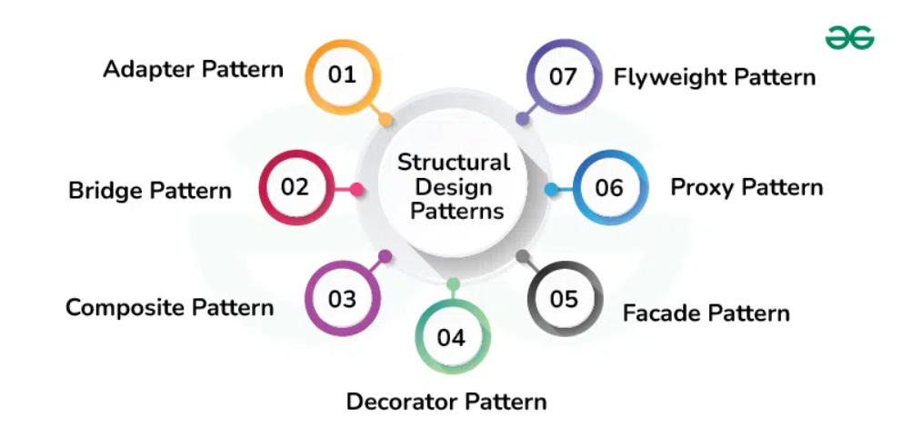
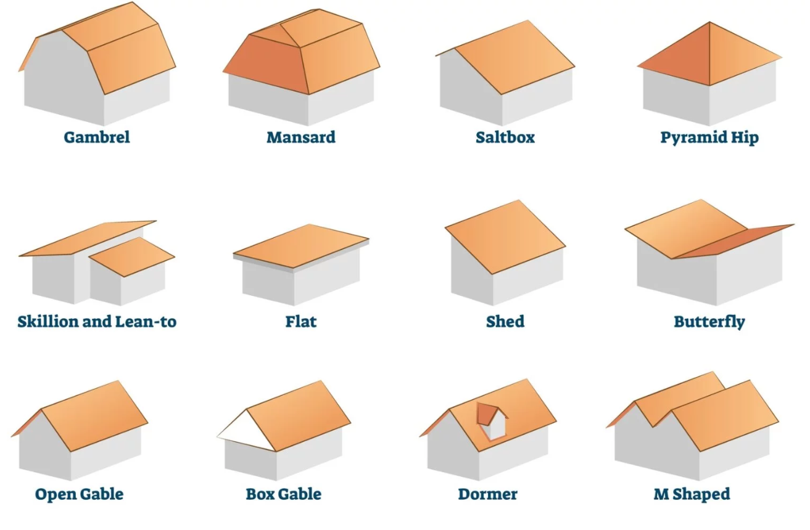

## The solution to all solutions (of a particular set of problems)

In the pursuit of development towards new solutions people often run into the same kinds of problems over and over again. As some quite ingenious people in the past have noticed, such similar and commonly occurring problems often beget similar and commonly occurring solutions, which seem to have very similar structures. These same people decided to catalogue and formalize these repeating structures into what we now know as "Design Patterns".

This was a very interesting concept to me, and I thought of it as just a sort of "solution to all solutions", or a meta-solution, to particular sets of problems. The formal development of the idea of "design patterns" sounded almost like the development of chess theory. In the scope of software development: "programming theory", if you will. Often times developers and problem solvers utilize design patterns whether they are aware of it or not.

## Natural examples

<em>The Phylliroe Sea Slug</em>

Probably the greatest unaware blind designer to ever exist is mother nature herself. In the pursuit of survival, life often runs into repeated and similar problems, and it often develops (or to be more accurate, coincidentally runs into) similar solutions to said problems. Need to develop flight? Evolve large and flat surfaces that you can move extremely fast and with enough force to lift yourself through the air (birds, bats, pterosaurs, insects). Need to swim? Develop a streamlined sleek body with the ability to push water via the use of undulation (fish, dolphins etc..). 

In biology this phenomenon is known as "convergent evolution", and I would argue that it is pretty similar to design patterns. Different life forms encountering the same survival problems would likely develop similarly structured solutions unknowingly, similar to how software developers on opposite sides of the world encountering the same programming problems would likely also develop similarly structured solutions unknowingly.

## Artificial examples

Then there are intentionally designed solutions produced by us, of course. As I stated in the first paragraph, chess theory is like a collection of design solutions to commonly encountered problems in the game of chess. There is also design patterns in architecture, such as sloped roofs for handling rain. Architecture itself is actually where this concept of "design patterns" comes from in the first place. There are similar examples in general technology as well. The need to mass produce written text gave rise to Chinese Wood Block printing and the Gutenberg Press, both operating on the principle of pressing ink onto a flat substrate through patterned blocks of material.

And then there is code, of course. In my code specifically, although I admittedly did it without knowing, I more than likely had used the Observer design pattern countless times when developing user interfaces of information collecting code over the years. The concept of design patterns makes me wonder if we could go a step further, if there could be patterns to developing design patterns, or if this concept could be applied elsewhere like towards engineering or medicine (it likely already has in a way for both). The new rise of advanced artificial intelligence could likely assist us with both, developing and "discovering" new design patterns that no one else had thought of before.

