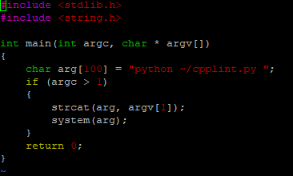

This code was a little thing that I created for ICS 212. For some background, ICS 212 is a class that focuses primarily on C and C++ programming, and in this class one of the biggest and most emphasized requirements for every single assignment was to follow a certain coding style. If this style was not followed well enough, points would be taken away from our coding assignments and projects.

Within our Unix workspace, there was some software that allowed us to automatically check if our written programs adhered to style. I remember in one of the lessons, our professor, Dr. Ravi, taught us a way to make our code interact with the Unix environment, and give it the ability to execute commands itself. 

Now, in order to use this style-checking program, we would have to type out a multi-word command for every single file. I eventually got a bit lazy and tired of having to constantly type some 12 or so characters every time I wanted to check a file's style, and when he taught us this an idea dawned on me. So, I wrote this simple program as a way to simplify this style checking process, so instead of having to write an entire incantation, I just simply had to type two characters: "/c", and the name of the file. This made checking coding style significantly easier and less tedious.
