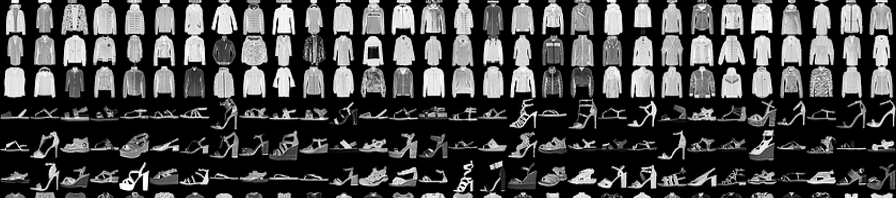
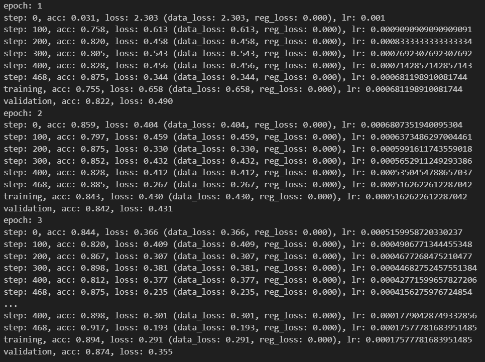
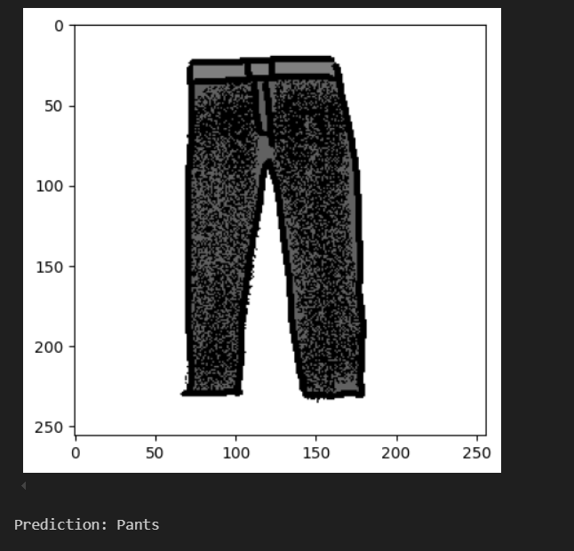

## Overview
This program is a deep learning neural network developed entirely without using any machine learning libraries such as PyTorch, using only pure Python and NumPy. Designed with guidance from the book <a href="https://nnfs.io/">Neural Networks from Scratch</a>, this was made for educational purposes to learn of the mathematics and mechanics behind deep learning models.

## Technical Details
This model was trained on the Fashion MNIST dataset (accessable on <a href="https://www.kaggle.com/datasets/zalando-research/fashionmnist">Kaggle</a>, examples of training data shown on top), a dataset containing tens of thousands of labeled 28x28 pixel images of articles of clothing.

It is also indeed capable of recognizing pieces of clothing from test images, including hand drawn ones.

## Links
Github: <a href="https://github.com/Acezorey/neural-network-learning">Link</a>
