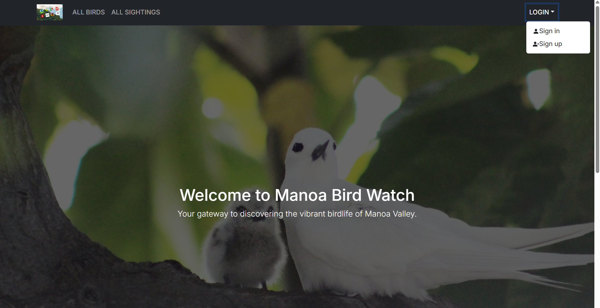
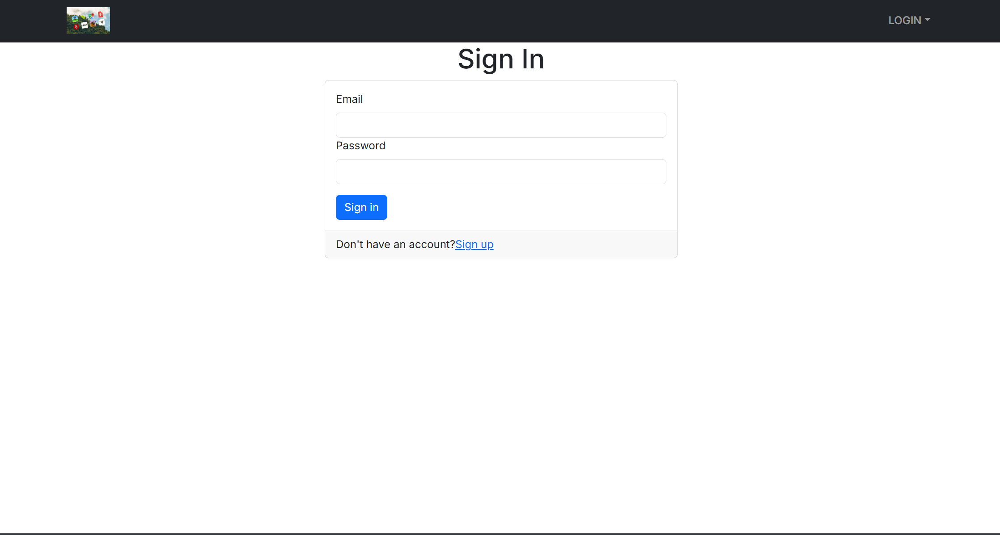
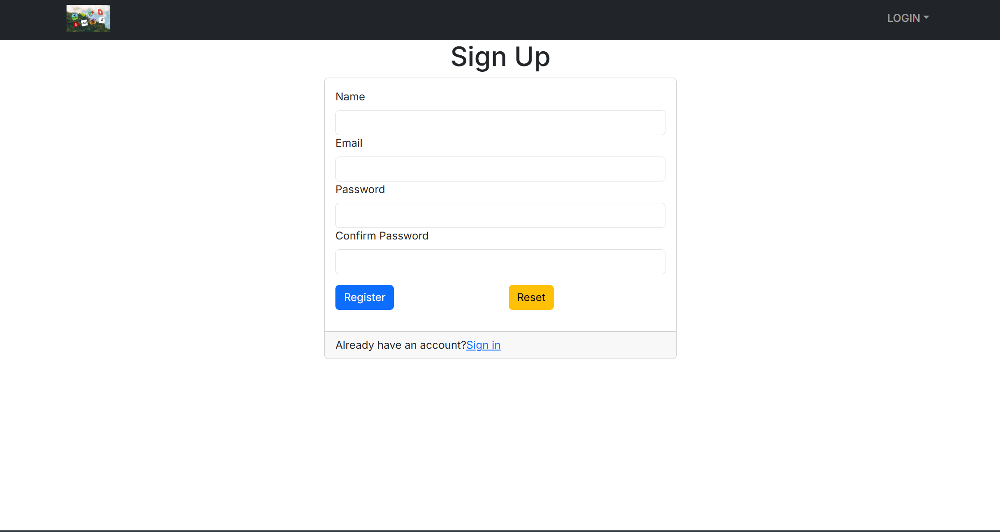
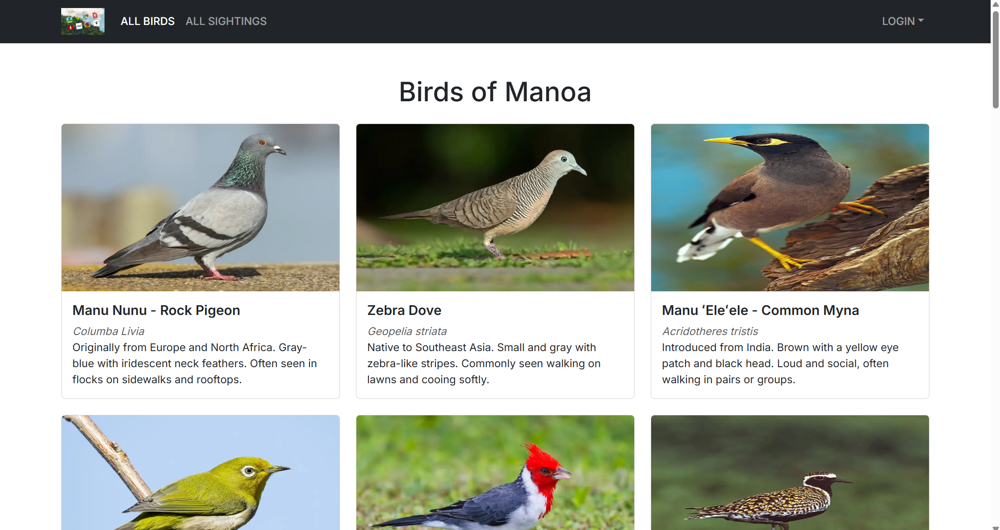
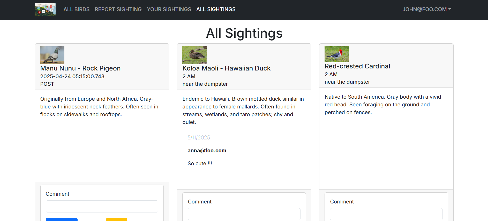
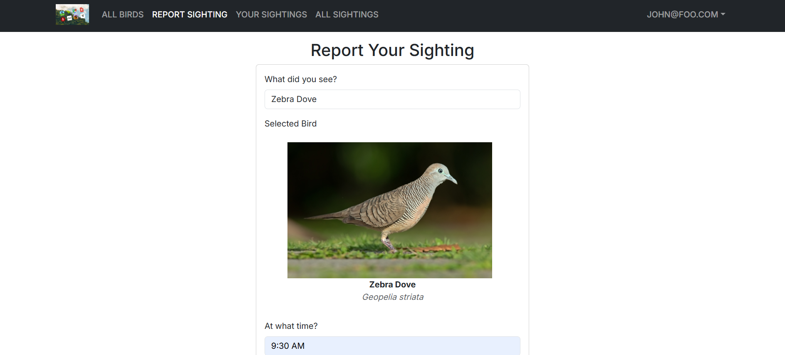
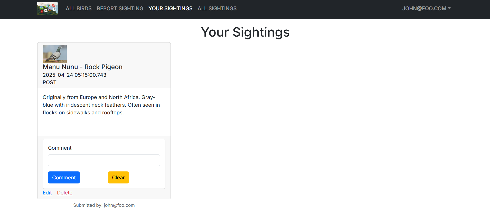

## Overview

Manoa Bird Watch is a web-based application where users can create and log into accounts, share what birds they have encountered, and see what birds other people have encountered, as well as edit/deleter their own and comment on other sightings as they wish. This website also displays every common species of bird found at the University of Hawaii at Manoa’s campus, as well as the surrounding Manoa Valley. This full stack app was developed using React and Next.js in the frontend, and PostgreSQL with Prisma as the backend.

## Design

The full Manoa Bird Watch website uses 7 pages in total.

Homepage.

 

A sign in and sign up page.

 

Page that lists every common species of bird found in Manoa.

 

One that lists all sightings made by all users.

 

Another that allows each user to upload/report their own sightings.

 

And finally a page that lists each individual user’s own sightings.

## My Contribution

This website was produced as a group final project for my ICS 314 Software Engineering class at UH Manoa. I contributed to this app’s development by configuring the Prisma schema and database action code, as well some of the architecture of the database itself. I also created the report sightings page.

As my group had a shared github organization where we stored our combined effort, I also contributed outside of the web application itself by adding a developer guide to the github organization homepage. Additionally I created the graphics of the website mockup for the initial project proposal.

## What I Learned

This project was a great crash course on learning how to use React, Next.js, PostgreSQL, and Prisma database functions. Outside of just coding, I also learned how to perform pull requests from Github branches, as well as how to manage issues using Github Projects. Perhaps most importantly however, I learned how to communicate and work as a development team alongside other programmers.

## Links

Here is the link to the github organization homepage: <a href="https://manoa-bird-watch.github.io/" target="_blank">Homepage</a>

And the link to the deployed website itself: <a href="https://m1-git-main-jeffrey8193s-projects.vercel.app/" target="_blank">Manoa Bird Watch</a>

Manoa Bird Watch was made by Ace Reyes, Alana Wesly, Jeffery Jian, and Chayanika Devi.

