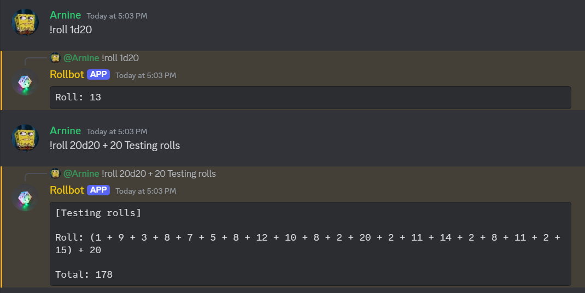

## Overview

RollBot is a discord bot/application designed to execute and return the values of simulated dice rolls via discord chat commands. Originally developed for tabletop games/DND campaigns with friends through discord.

## Technical Details

RollBot is developed entirely using Python, using the discord.py library and consequently the Discord API to communicate directly to discord chats. To ensure 24/7 uptime, this program is hosted on PebbleHost, a paid virtual private server (VPS) service that specializes in hosting video game servers and discord bots.

To get help on commands, type "!help".

All other commands begin with the prefix "!roll". To roll a single 20 sided dice, type "!roll 1d20". To roll 5 20 sided dice, "!roll 5d20". To add or subtract a constant to a roll result, "!roll 3d6 + 5" or "!roll 7d19 - 2". RollBot will additionally automatically calculate the sum of all rolled values for multiple rolled dice, along with the constant added/subtracted, if there is one.

For all rolls, the generic structure is as follows: "!roll XdY +/- Z".
- X denotes the number of dice to roll
- Y denotes the size of the dice
- Z denotes the constant to add or subtract from the total

Rolls can also be labeled by typing in extra words, such as "!roll 6d20 character stats". This command would yield a roll result with the label "character stats". No extra commands is needed for this.

All roll results are also programmed to be direct replies to the command given, referencing the user which sent the command, to eliminate ambiguity.

## Links

Github: <a href="https://github.com/Acezorey/Rollbot">Link</a>

