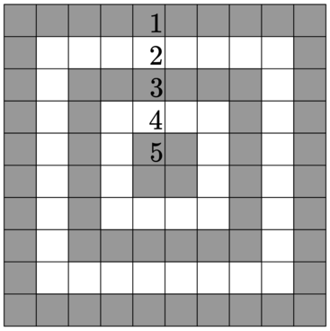

This was a solution that I coded up for a problem in a CodeForces virtual competition. To give some background, CodeForces is an "online judge" competitive programming website, where it tests the submissions of the users in relation to problems presented on a problemset. Competitive programming itself is a hobby of mine, where I solve as many problems as I can during a virtual competition for points, and get rated against other competitive programmers. Being completely honest, I am not the best at this, nor was my code for this problem particularly pretty to look at, but it got the job done nonetheless.

In this problem, we are presented with a 10 by 10 target (represented in code by a 2d array of dots and "X" strings), and we are given the scenario of an archer named Vlad who fires arrows at the target. Each ring progressively increases in point count as they get closer to the center, and we are given the task of calculating Vlad's total score. In order to pass, our code must be judged by being tested with a variety of datasets (of which we were not allowed to see during the competition), and it must pass all of them. This is one of the simpler problems on that website, and they get exponentially more difficult at higher levels.

[Here is the link to the problem itself](https://codeforces.com/contest/1873/problem/C) if you are interested.
